#### Apollo单机模式配置中心结合springboot的使用

* [1].首先下载apollo的单机模式的安装文件[下载安装文件](https://github.com/nobodyiam/apollo-build-scripts)
    * 1.1 启动单机配置中心，运行命令：./demo.sh start
    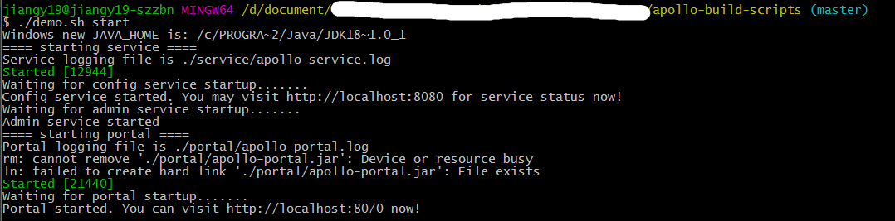
    * 1.2 查看效果：
        * 1.2.1 登录页面
        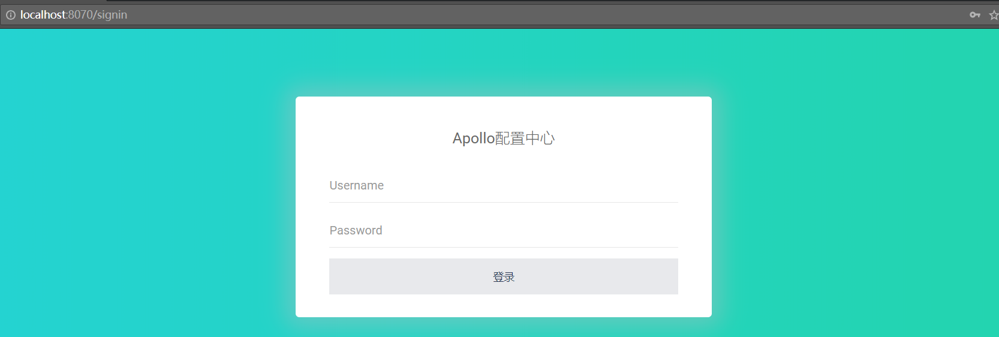
        * 1.2.2 首页布局
        
        * 1.2.3 新增配置
        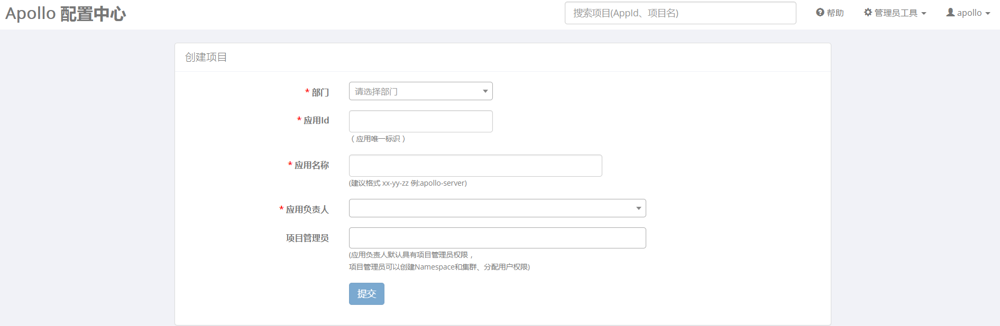
        
* [2].下载apollo项目到本地，导入到idea中，然后在父目录下执行```maven install``` 操作
    * 2.1 下载apollo项目，点击[下载](https://github.com/ctripcorp/apollo.git),然后导入到idea中，进行打包操作
    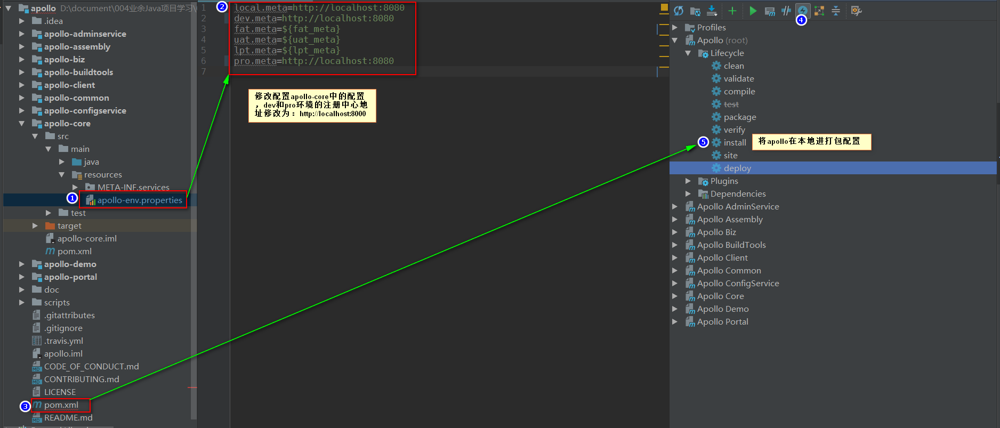
    * 2.2 查看打包后的文件
    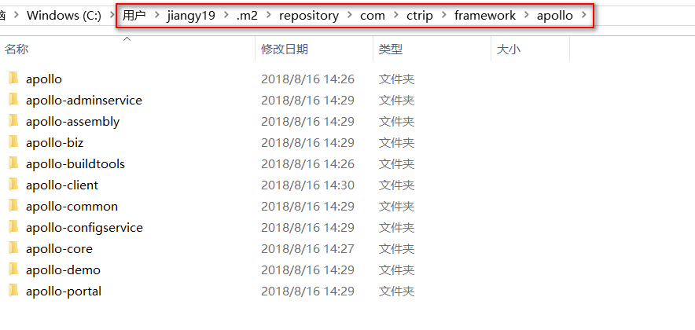


* [3].创建springboot项目，进行配置中心测试
    * 3.1 添加项目依赖
    ```xml
        <!--eureka-->
        <dependency>
            <groupId>org.springframework.cloud</groupId>
            <artifactId>spring-cloud-starter-eureka</artifactId>
        </dependency>
        <!--eureka Server-->
        <dependency>
            <groupId>org.springframework.cloud</groupId>
            <artifactId>spring-cloud-starter-eureka-server</artifactId>
        </dependency>
        <!--apollo-client-->
        <dependency>
            <groupId>com.ctrip.framework.apollo</groupId>
            <artifactId>apollo-client</artifactId>
            <version>0.11.0-SNAPSHOT</version><!--本地打包后的apollo的版本-->
        </dependency>
        <!--test-->
        <dependency>
            <groupId>org.springframework.boot</groupId>
            <artifactId>spring-boot-starter-test</artifactId>
            <scope>test</scope>
        </dependency>
    ```
    
    * 3.2 使用默认的配置文件配置如下信息：
    ```properties
        spring.application.name = rainbow-apollo
        server.port = 8830
        logging.level = ERROR
        eureka.client.serviceUrl.defaultZone = http://127.0.0.1:8080/eureka/
        eureka.client.healthcheck.enabled = true
        eureka.client.registerWithEureka = true
        eureka.client.fetchRegistry = true
        eureka.client.eurekaServiceUrlPollIntervalSeconds = 60
        eureka.instance.preferIpAddress = true
    ```
    * 3.3 然后启动项目,保证启动没有问题；
    * 3.4 登录apollo配置中心后，创建一个新的项目，核心是appid
    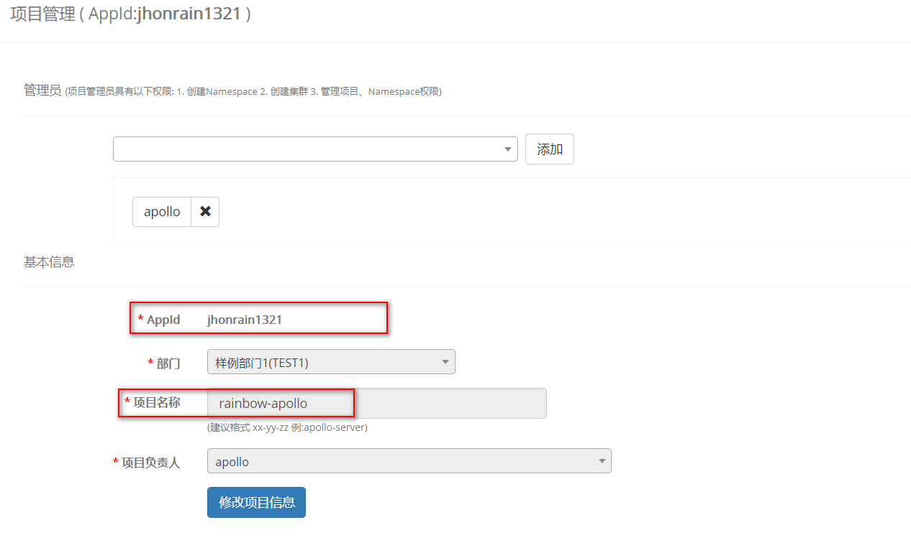
    * 3.5 对新增项目进行配置
    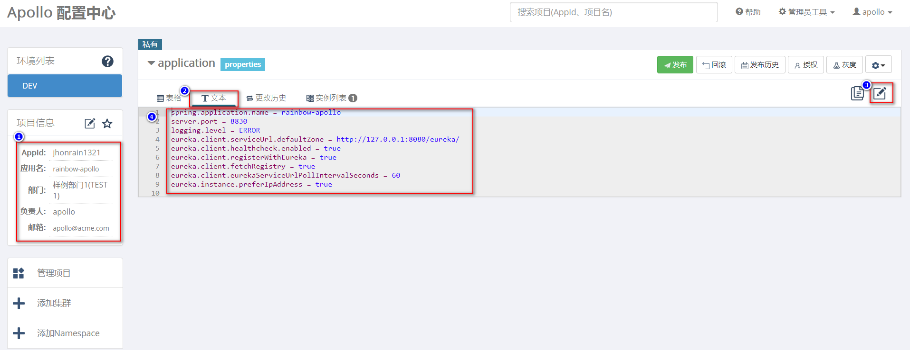
    * 3.6 对配置进行发布操作
    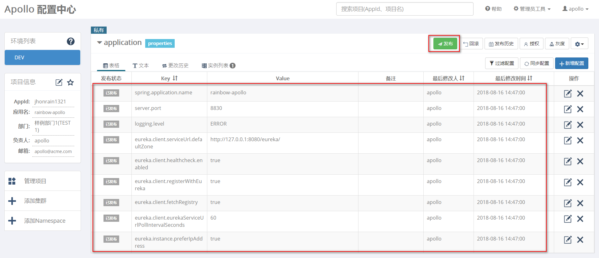
    * 3.7 修改本地运行环境（指定为DEV）,路径为：``` C:\opt\settings\server.properties ```
    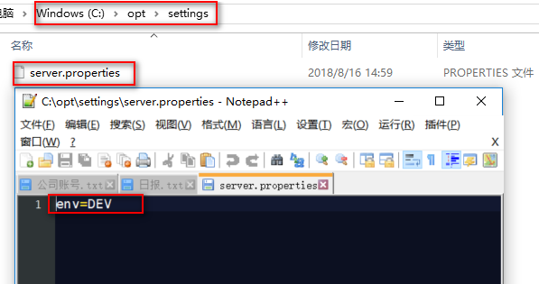
    * 3.8 删除项目中的application.properties文件，新增META-INF文件夹和app.properties文件,配置信息如下：
        ```properties
          app.id=jhonrain1321
        ```
        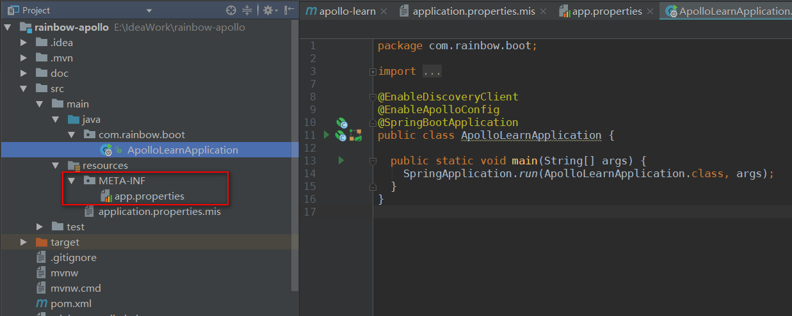
    * 3.9 添加apollo配置中心注解:@EnableApolloConfig
    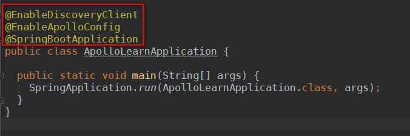
    * 3.10 启动项目，如果没有报错，那么就成功了！
    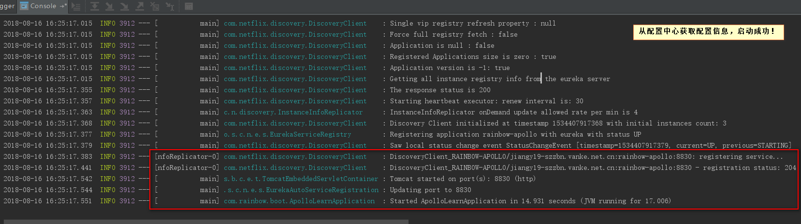
    * 3.11 查看Eureka注册中心的信息
    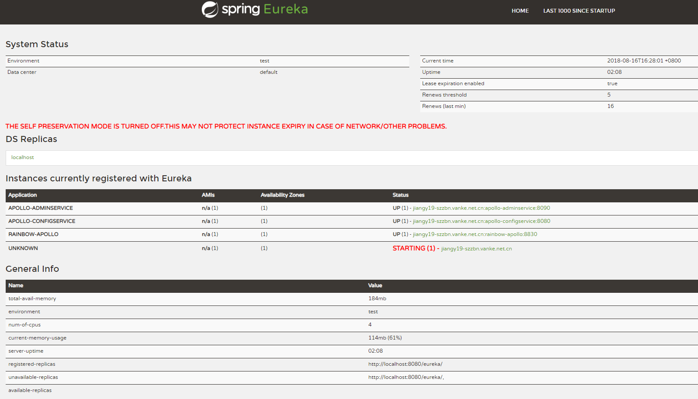
    
    
* 小结
    待补充！
    