#### 本地搭建apollo配置中心
* 首先，下载apollo项目源码，[apollo配置中心](https://github.com/ctripcorp/apollo.git)
* 然后，将项目导入到Idea中，如下图所示：
    * 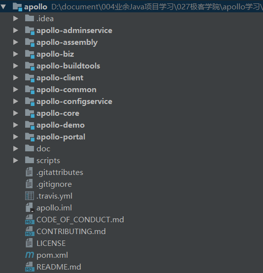
    * apollo项目的整体架构预览：
    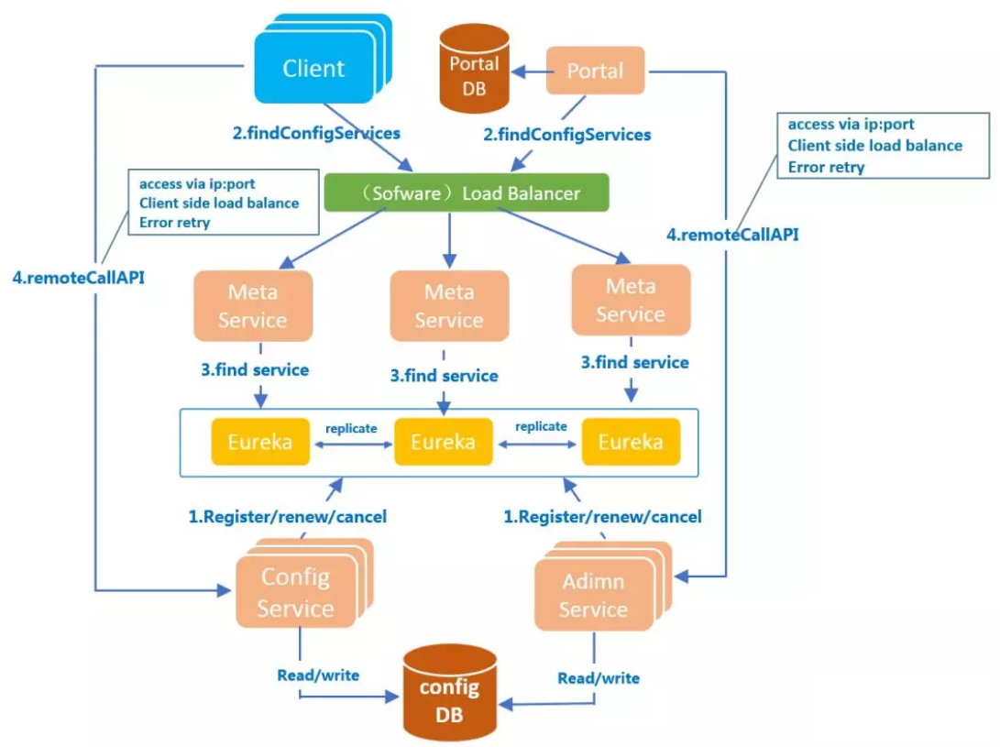
 
* ConfigService项目配置信息修改
    * 配置数据库信息：
    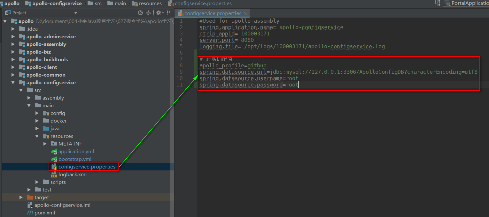
    * 配置端口号：
    
    * 修改注册中心的端口号：
    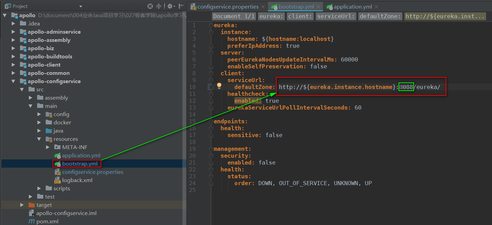
    
* AdminService项目配置信息修改
    * 配置数据库信息：
    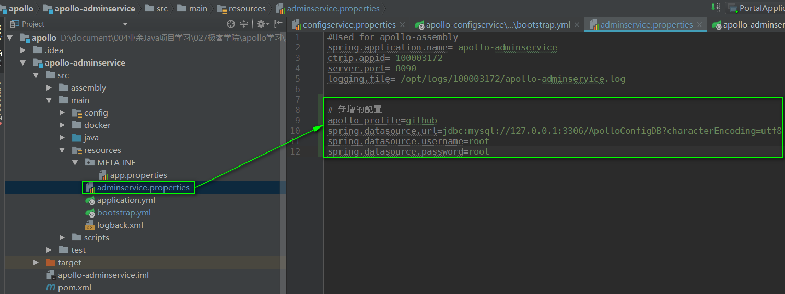
    * 修改注册中心的端口号：
    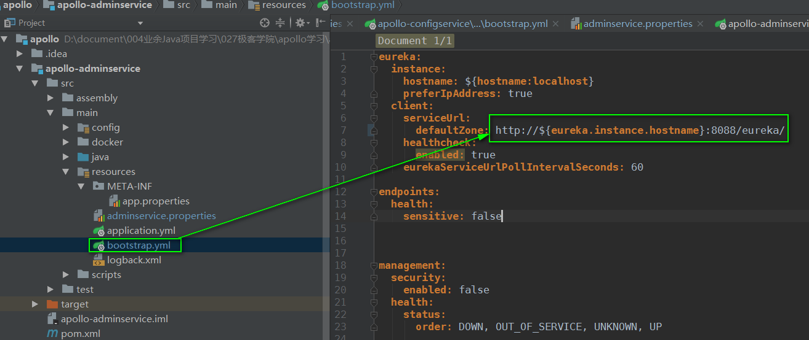
    
* Apollo-Core项目配置信息修改
    * 修改注册中心的地址：
    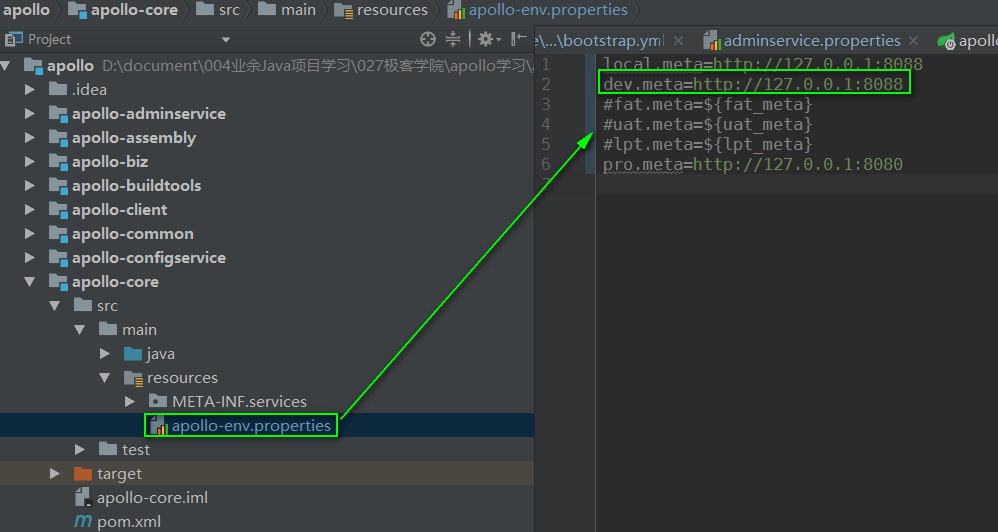
    

* Portal项目配置信息修改
    * 启动类加载配置信息：
    
    * 修改应用的端口号：
    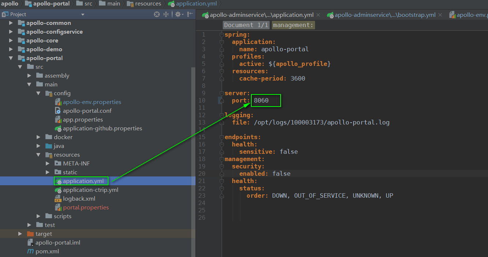
    * 配置数据库信息：
    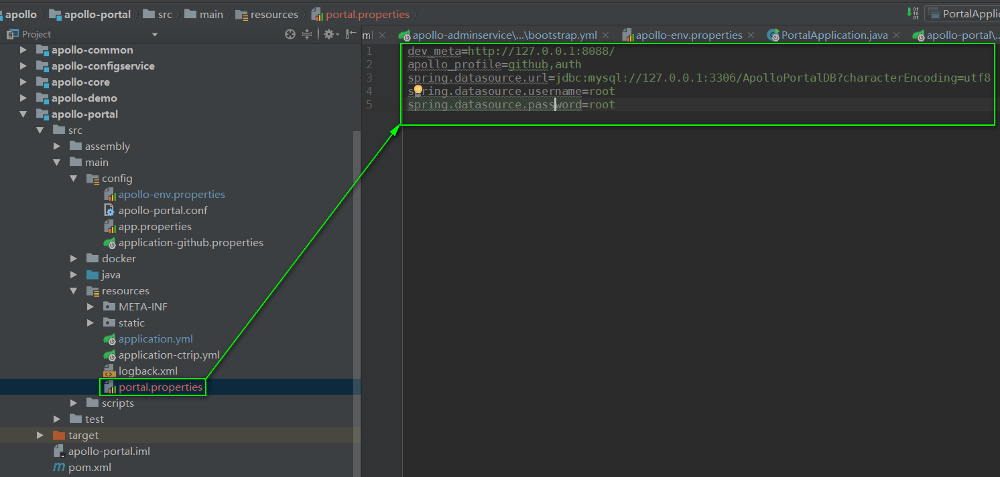
    * 配置注册中心地址：
    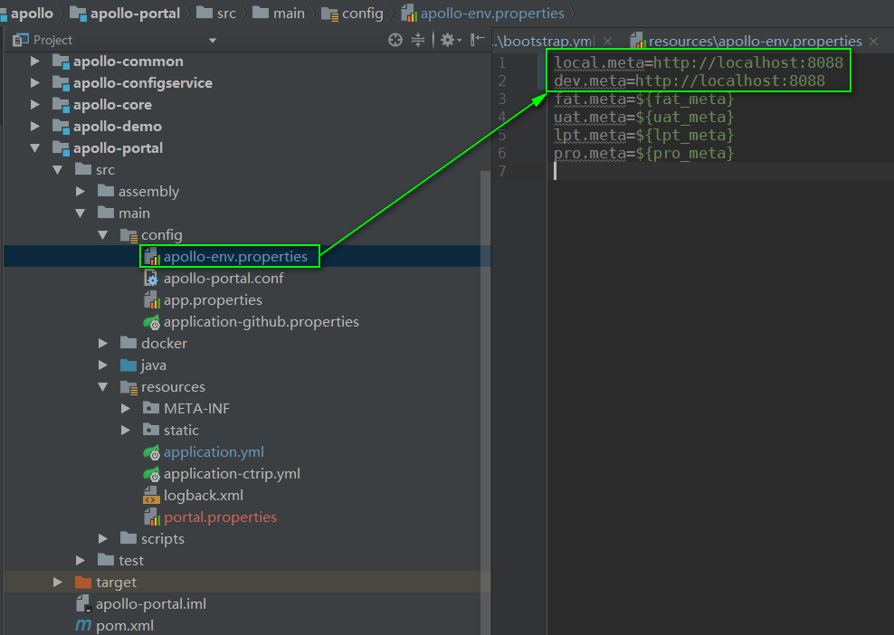

* 本地访问apollo配置中心
    * 依次启动ConfigServiceApplication-->AdminServiceApplication-->PortalApplication
    * 访问本地apollo配置中心地址：http://localhost:8060,效果如下：
    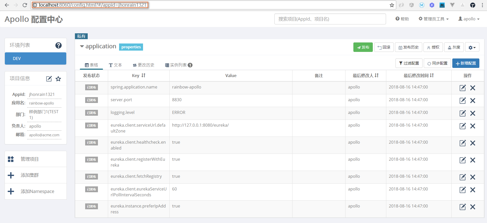
    
* 到此，本地配置Apollo配置中心已经搭建完成，恭喜！
    