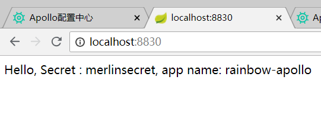

#### 配置信息脱敏处理
* 1.jasypt工具进行加密处理，添加maven依赖
    ```xml
    <dependency>
        <groupId>com.github.ulisesbocchio</groupId>
        <artifactId>jasypt-spring-boot-starter</artifactId>
        <version>1.18</version>
    </dependency>
    ```
* 2.编写加密解密方法
    ```java
    package com.rainbow.boot.controller;
    
    import lombok.extern.slf4j.Slf4j;
    import org.jasypt.encryption.StringEncryptor;
    import org.springframework.beans.factory.annotation.Autowired;
    import org.springframework.web.bind.annotation.PostMapping;
    import org.springframework.web.bind.annotation.RequestParam;
    import org.springframework.web.bind.annotation.RestController;
    
    /**
     * <p>功能描述</br>加密解密控制器</p>
     *
     * @author jiangy19
     * @version v1.0
     * @projectName rainbow-apollo
     * @date 2018/8/17 10:25
     */
    @Slf4j
    @RestController
    public class JasyptController {
    
      @Autowired
      private StringEncryptor stringEncryptor;
    
      private static final String ENCRYPTED_VALUE_PREFIX = "ENC(";
      private static final String ENCRYPTED_VALUE_SUFFIX = ")";
    
    
      /**
       * <pre>判断是否是加密的值</pre>
       *
       * @param value
       * @return
       */
      public static boolean isEncryptedValue(final String value) {
        if (value == null) {
          return false;
        }
        final String trimmedValue = value.trim();
        return (trimmedValue.startsWith(ENCRYPTED_VALUE_PREFIX) && trimmedValue.endsWith(ENCRYPTED_VALUE_SUFFIX));
      }
    
      /**
       * <pre>获取加密后的信息</pre>
       *
       * @param value
       * @return
       */
      private static String getInnerEncryptedValue(final String value) {
        return value.substring(ENCRYPTED_VALUE_PREFIX.length(), (value.length() - ENCRYPTED_VALUE_SUFFIX.length()));
      }
    
      /**
       * <pre>加密方法</pre>
       *
       * @param text 待加密的值
       * @return
       */
      @PostMapping("/encrypt")
      public String encrypt(@RequestParam("text") String text) {
        String encrypted = stringEncryptor.encrypt(text.trim());
        log.info("ORIGINAL: " + text);
        log.info("ENCRYPTED: " + encrypted);
        log.info("DECRYPTED: " + stringEncryptor.decrypt(encrypted));
        return String.format("ENC(%s)", encrypted);
      }
    
      /**
       * <pre>解密</pre>
       *
       * @param text 密文
       * @return
       */
      @PostMapping("/decrypt")
      public String decrypt(@RequestParam("text") String text) {
        String decrypted = stringEncryptor.decrypt(isEncryptedValue(text) ? getInnerEncryptedValue(text) : text);
        log.info("ORIGINAL: " + text);
        log.info("DECRYPTED: " + decrypted);
        log.info("ENCRYPTED: " + String.format("ENC(%s)", stringEncryptor.encrypt(decrypted)));
        return decrypted;
      }
    }
    
    ```
* 3.系统初始化的时候指定加密的盐值


* 4.对secret(敏感信息)进行加密处理
    

    

    
    
* 5.获取配置信息(app.info,app.secret)，通过注解方式


* 6.应用访问获取配置中心的配置信息


* 7.动态修改配置中心的值，不启动程序，获取最新的配置信息(结果没有获取到最新的值，为啥？具体原因下篇在说明)
    

    


