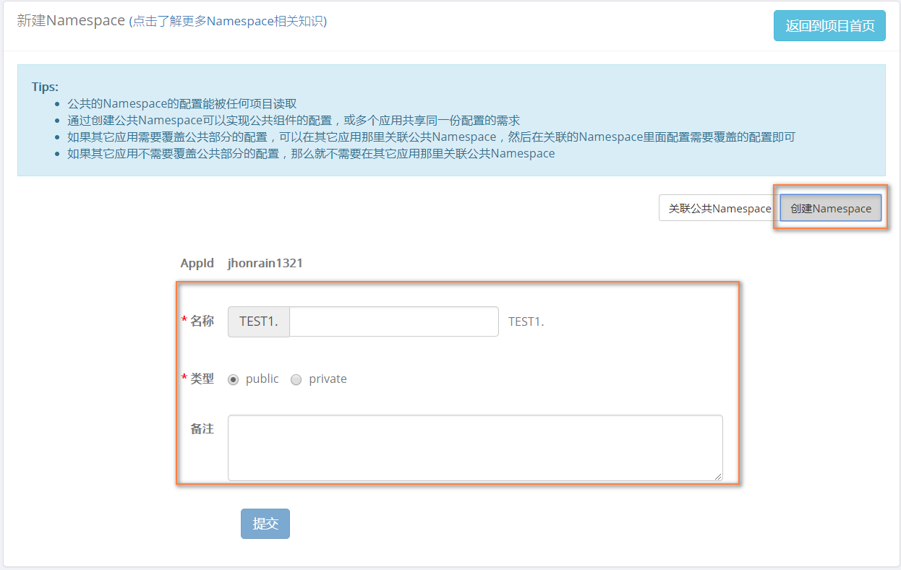
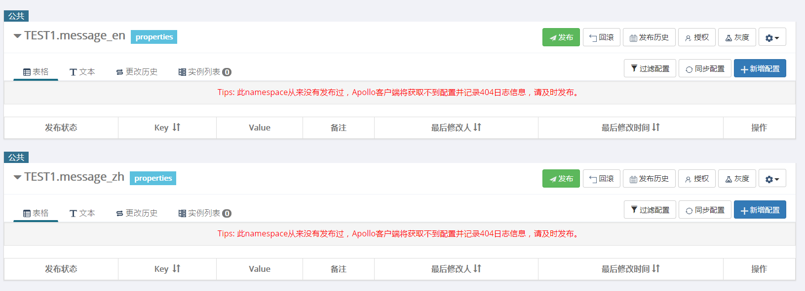
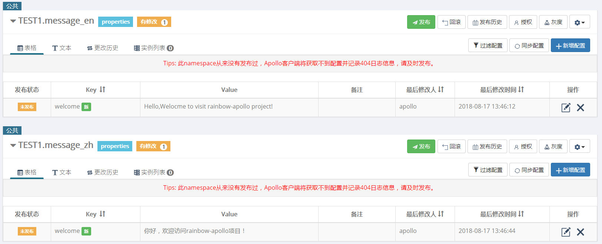
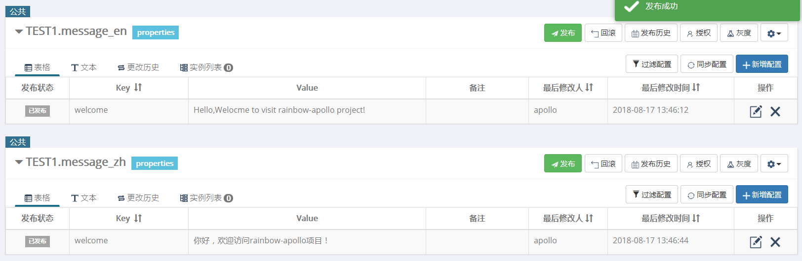
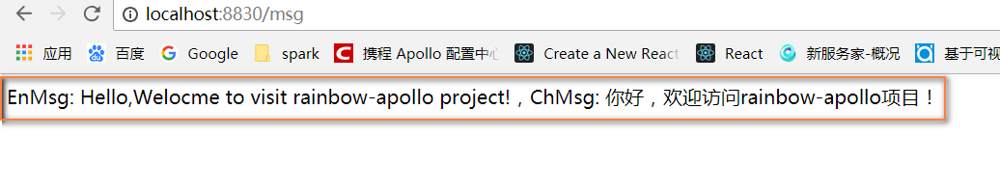

#### 国际化Apollo配置中心实现
* 创建命名空间


* 创建国际化配置信息的命名空间


* 添加示例配置信息


* 发布配置完成之后的示例


* 编写代码实现
    ```java
    package com.rainbow.boot.config;
    
    import com.ctrip.framework.apollo.Config;
    import com.ctrip.framework.apollo.ConfigService;
    import com.ctrip.framework.apollo.core.utils.StringUtils;
    import com.rainbow.boot.constant.ConfigConstants;
    import org.springframework.beans.factory.InitializingBean;
    import org.springframework.context.annotation.Configuration;
    
    /**
     * <p>功能描述</br>国际化的配置信息</p>
     *
     * @author jiangy19
     * @version v1.0
     * @projectName rainbow-apollo
     * @date 2018/8/17 13:48
     */
    @Configuration
    public class ApolloMessageUtil implements InitializingBean {
    
    
      private static Config enPublicConfig = ConfigService.getConfig(ConfigConstants.EN_NAMENSPACE);
      private static Config zhCnPublicConfig = ConfigService.getConfig(ConfigConstants.ZH_CN_NAMESPACE);
    
      private static ApolloMessageUtil apolloMessage = null;
    
      /**
       * <pre>工具类</pre>
       *
       * @return
       */
      public static ApolloMessageUtil getApolloMessage() {
        return apolloMessage;
      }
    
      @Override
      public void afterPropertiesSet() throws Exception {
        apolloMessage = this;
      }
    
      /**
       * <pre>获取配置信息</pre>
       *
       * @param key
       * @param lang
       * @return
       */
      public static String getMessage(String key, String lang) {
        String msg = null;
        if (!StringUtils.isEmpty(key) && !StringUtils.isEmpty(lang)) {
          if (lang.equalsIgnoreCase(ConfigConstants.ZH_CN)) {
            msg = zhCnPublicConfig.getProperty(key, ConfigConstants.DEFAULT_BLANK);
          } else if (lang.equalsIgnoreCase(ConfigConstants.EN)) {
            msg = enPublicConfig.getProperty(key, ConfigConstants.DEFAULT_BLANK);
          }
        } else {
          msg = zhCnPublicConfig.getProperty(key, ConfigConstants.DEFAULT_BLANK);
        }
        return msg;
      }
    }
    ```
    
* 效果展示
