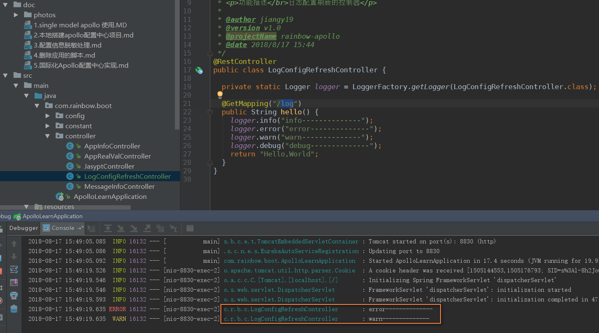
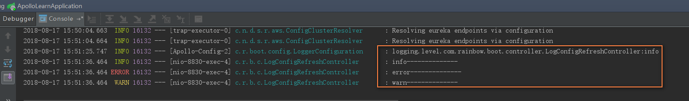
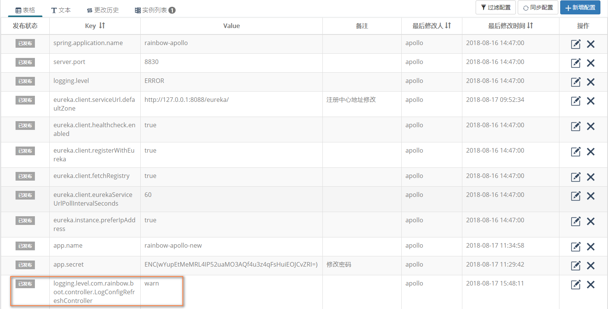

#### 日志监听级别配置到配置中心
* 监听日志级别变更的代码实现
    ```java
    package com.rainbow.boot.config;
    
    import com.ctrip.framework.apollo.Config;
    import com.ctrip.framework.apollo.model.ConfigChangeEvent;
    import com.ctrip.framework.apollo.spring.annotation.ApolloConfig;
    import com.ctrip.framework.apollo.spring.annotation.ApolloConfigChangeListener;
    import org.slf4j.Logger;
    import org.slf4j.LoggerFactory;
    import org.springframework.beans.factory.annotation.Autowired;
    import org.springframework.boot.logging.LogLevel;
    import org.springframework.boot.logging.LoggingSystem;
    import org.springframework.context.annotation.Configuration;
    
    import javax.annotation.PostConstruct;
    import java.util.Set;
    
    /**
     * <p>功能描述</br>日志的配置信息</p>
     *
     * @author jiangy19
     * @version v1.0
     * @projectName rainbow-apollo
     * @date 2018/8/17 15:28
     */
    @Configuration
    public class LoggerConfiguration {
    
      private static final Logger logger = LoggerFactory.getLogger(LoggerConfiguration.class);
      private static final String LOGGER_TAG = "logging.level.";
      private static final String DEFAULT_LOG_LEVEL = "info";
    
      @Autowired
      private LoggingSystem loggingSystem;
    
      @ApolloConfig
      private Config config;
    
      /**
       * <pre>Apollo配置的变更监听</pre>
       *
       * @param changeEvent
       */
      @ApolloConfigChangeListener
      private void configChangeListter(ConfigChangeEvent changeEvent) {
        refreshLoggingLevels();
      }
    
      /**
       * <pre>处理之后的操作</pre>
       */
      @PostConstruct
      private void refreshLoggingLevels() {
        Set<String> keyNames = config.getPropertyNames();
        for (String key : keyNames) {
          if (containsIgnoreCase(key, LOGGER_TAG)) {
            String strLevel = config.getProperty(key, DEFAULT_LOG_LEVEL);
            LogLevel level = LogLevel.valueOf(strLevel.toUpperCase());
            loggingSystem.setLogLevel(key.replace(LOGGER_TAG, ""), level);
            logger.info("{}:{}", key, strLevel);
          }
        }
      }
    
      /**
       * <pre>区域内是否包含</pre>
       *
       * @param str
       * @param searchStr
       * @return
       */
      private static boolean containsIgnoreCase(String str, String searchStr) {
        if (str == null || searchStr == null) {
          return false;
        }
        int len = searchStr.length();
        int max = str.length() - len;
        for (int i = 0; i <= max; i++) {
          if (str.regionMatches(true, i, searchStr, 0, len)) {
            return true;
          }
        }
        return false;
      }
    }
    ```
    
* Apollo配置中心配置日志级别--默认配置为warn级别


* 修改配置中心的日志界别--info级别


* 再次访问，查看效果，自动切换到了info级别

    
    