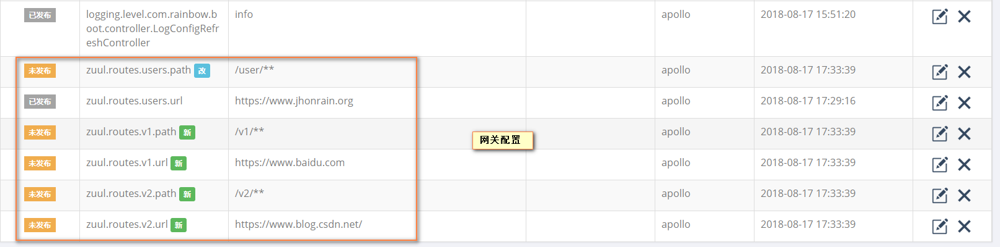
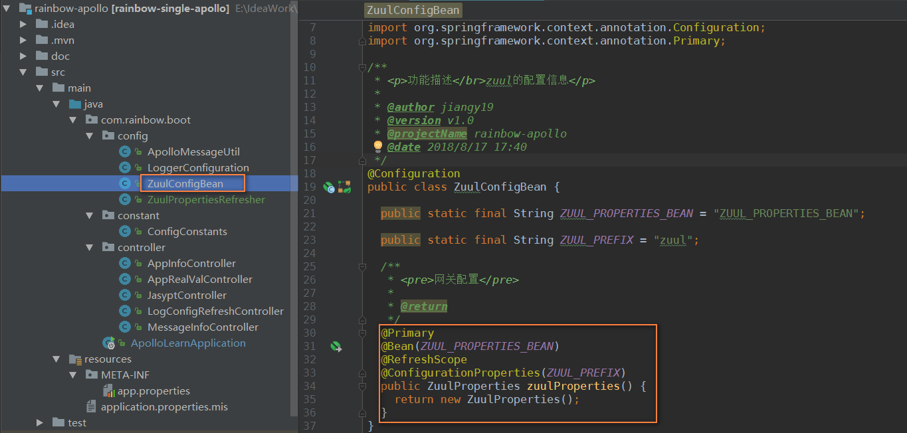
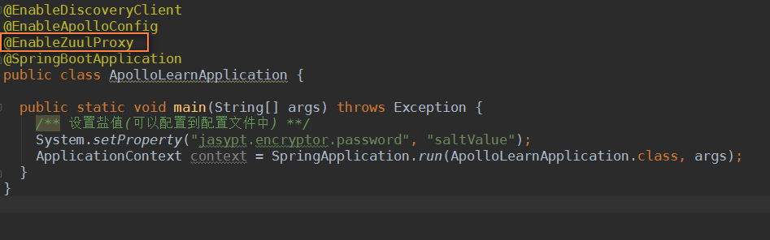

#### ZUUL网关配置信息整合到配置中心
* 添加zuul的maven依赖
    ```xml
    <!--网关配置-->
    <dependency>
        <groupId>org.springframework.cloud</groupId>
        <artifactId>spring-cloud-starter-zuul</artifactId>
    </dependency>
    ```
* 配置zuul的属性配置bean
    * Apollo网关配置
    
    * zuul属性配置bean
    
    * 开启zuul代理注解
    